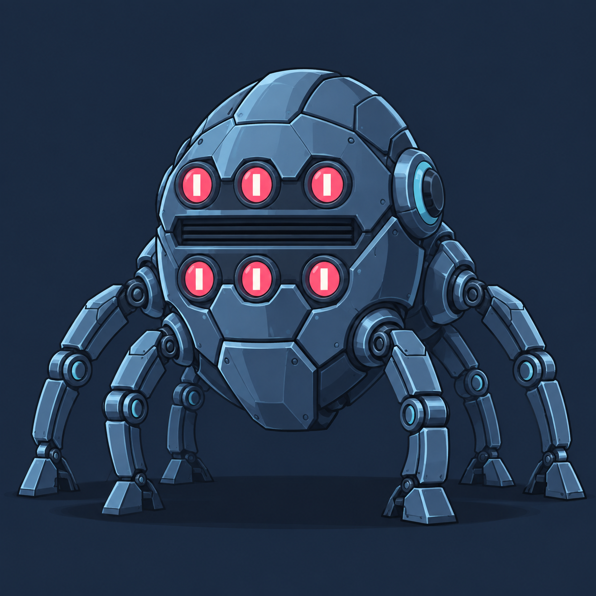
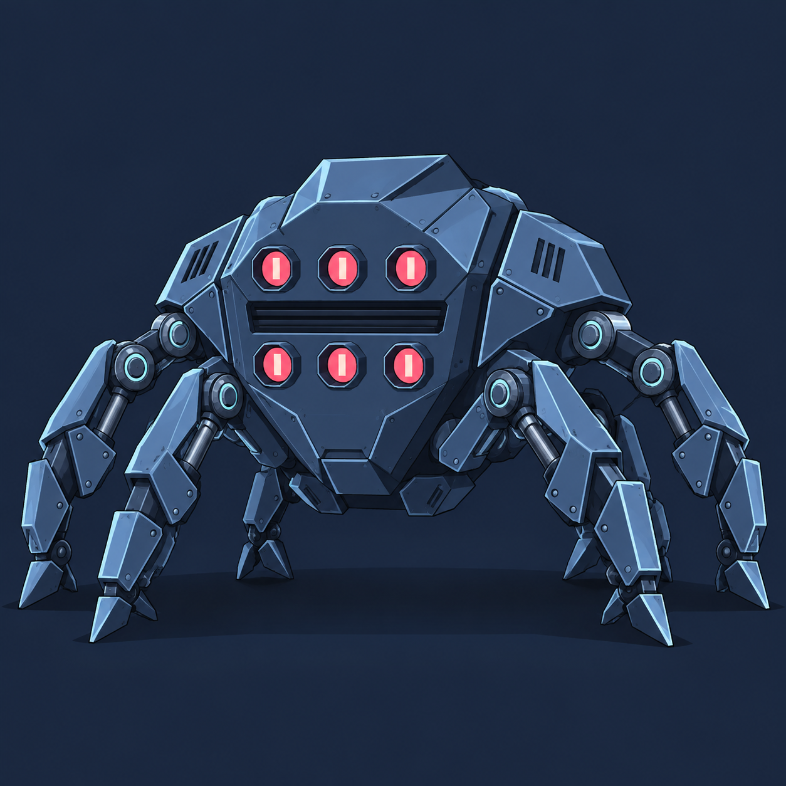
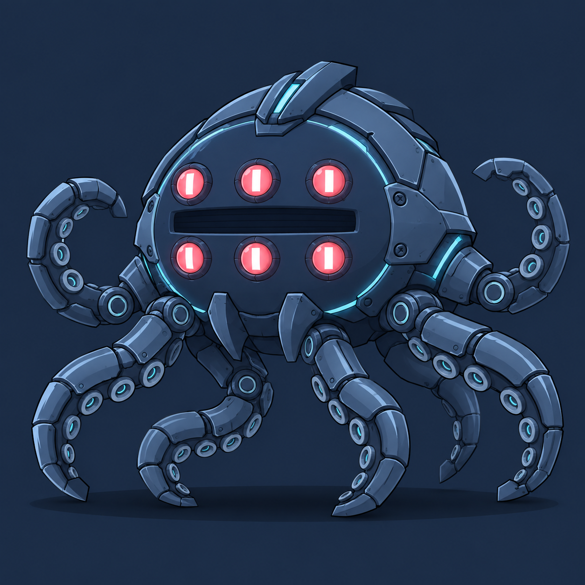
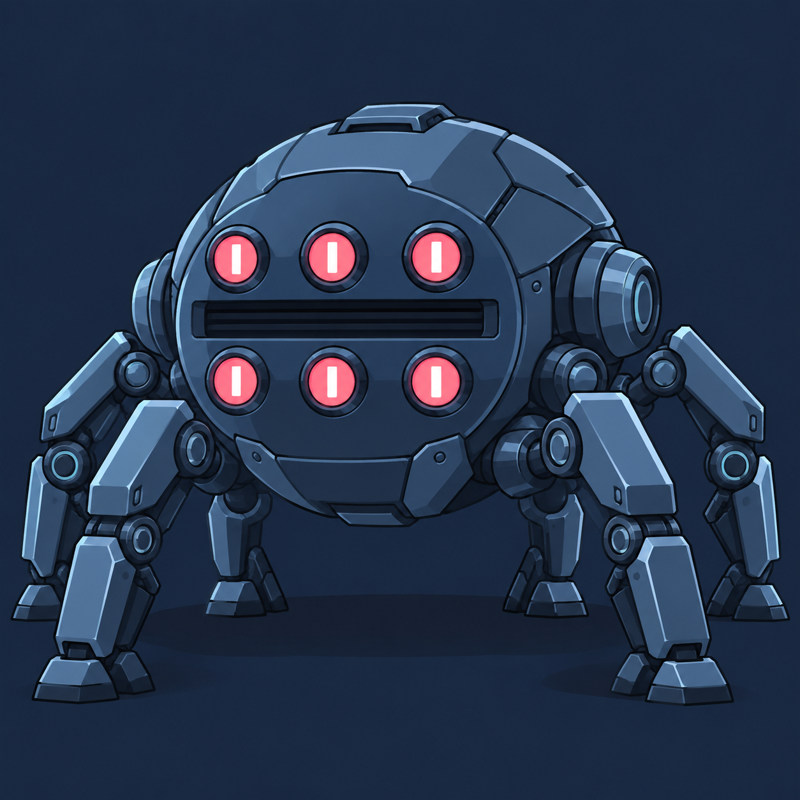

# Boss image concepts

Generated with the built-in image_gen tool using the user's current-game screenshot as reference. Concept exploration only; not integrated into gameplay. Limb visibility/count will need explicit resolution when preparing animation assets.

## A — Armored sentinel

### Generation prompt

Use case: stylized-concept. Create ONE polished game boss concept image, version A — Armored sentinel. Input screenshot is a reference for the CURRENT boss on the right and the game's flat illustrated night-city art style; do not copy its crude ellipse rendering. Closest evolution of the reference: rounded upright egg-shaped blue-steel carapace, beautifully layered overlapping armor plates, beveled rims, restrained seams, six inset pink optical eyes in two rows of three with pale vertical pupils, dark recessed horizontal vent between rows, eight articulated mechanical tentacles supporting body. Heavy, solid, refined machinery. Preserve recognizable identity, six eyes exactly and eight limbs. Professional hand-painted 2D game concept artwork with clean dark outlines, carefully controlled 3-tone metal shading and readable shapes at 210px game size. Match the refined robotic horse's material language in the reference. Full creature completely in frame, centered, orthographic near-front view for a side-scrolling game, facing slightly left. Simple muted midnight-blue backdrop with only a floor contact shadow; no city, no horse, no minions, no HUD, no text, no collage. Cool blue steel and slate palette with pale blue edge highlights and pink eye accents. Richer structure and anatomy, not random texture or excessive neon. Square image.

## B — Spider siege engine

### Generation prompt

Use case: stylized-concept. Create ONE polished game boss concept image, version B — Spider siege engine. Input screenshot is a reference for the CURRENT boss on the right and the game's flat illustrated night-city art style; do not copy its crude ellipse rendering. More angular aggressive evolution: broad shield-shaped armored blue body, six pink sensor eyes in two rows of three, recessed black horizontal vent, eight clearly articulated crab-spider tentacle limbs with sturdy piston joints and pointed feet; low braced menacing silhouette, sharp layered panels, disciplined material detail. Preserve recognizable identity, six eyes exactly and eight limbs. Professional hand-painted 2D game concept artwork with clean dark outlines, carefully controlled 3-tone metal shading and readable shapes at 210px game size. Match the refined robotic horse's material language in the reference. Full creature completely in frame, centered, orthographic near-front view for a side-scrolling game, facing slightly left. Simple muted midnight-blue backdrop with only a floor contact shadow; no city, no horse, no minions, no HUD, no text, no collage. Cool blue steel and slate palette with pale blue edge highlights and pink eye accents. Richer structure and anatomy, not random texture or excessive neon. Square image.

## C — Abyssal machine

### Generation prompt

Use case: stylized-concept. Create ONE polished game boss concept image, version C — Abyssal machine. Input screenshot is a reference for the CURRENT boss on the right and the game's flat illustrated night-city art style; do not copy its crude ellipse rendering. More cephalopod-like evolution: domed oval navy armored mantle, six luminous coral-pink eyes in two rows of three and central dark vent; eight supple segmented mechanical tentacles curl visibly around the body with metallic suction-ring details. Elegant fluid silhouette, layered shell, subtle cyan conduits, unsettling alien intelligence. Preserve recognizable identity, six eyes exactly and eight limbs. Professional hand-painted 2D game concept artwork with clean dark outlines, carefully controlled 3-tone metal shading and readable shapes at 210px game size. Match the refined robotic horse's material language in the reference. Full creature completely in frame, centered, orthographic near-front view for a side-scrolling game, facing slightly left. Simple muted midnight-blue backdrop with only a floor contact shadow; no city, no horse, no minions, no HUD, no text, no collage. Cool blue steel and slate palette with pale blue edge highlights and pink eye accents. Richer structure and anatomy, not random texture or excessive neon. Square image.

## D — Arcade titan

### Generation prompt

Use case: stylized-concept. Create ONE polished game boss concept image, version D — Arcade titan. Input screenshot is a reference for the CURRENT boss on the right and the game's flat illustrated night-city art style; do not copy its crude ellipse rendering. Bold readable premium arcade evolution: massive compact oval blue-steel shell, oversized six pink eyes in two rows of three, recessed dark horizontal vent, eight thick beautifully jointed tentacle legs, large clean armor masses with select bevels and exposed joints. Strong graphic silhouette and restrained cel shading, intimidating rather than cute. Preserve recognizable identity, six eyes exactly and eight limbs. Professional hand-painted 2D game concept artwork with clean dark outlines, carefully controlled 3-tone metal shading and readable shapes at 210px game size. Match the refined robotic horse's material language in the reference. Full creature completely in frame, centered, orthographic near-front view for a side-scrolling game, facing slightly left. Simple muted midnight-blue backdrop with only a floor contact shadow; no city, no horse, no minions, no HUD, no text, no collage. Cool blue steel and slate palette with pale blue edge highlights and pink eye accents. Richer structure and anatomy, not random texture or excessive neon. Square image.

